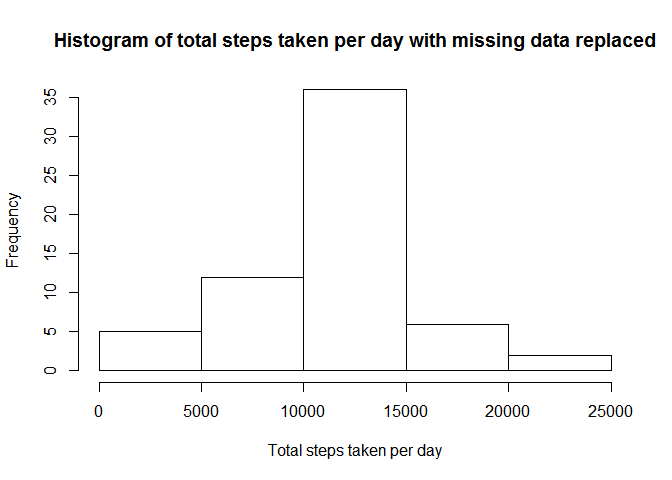

# Reproducible Research: Peer Assessment 1


## Loading and preprocessing the data


```r
file<-"activity.csv"
url<-"https://d396qusza40orc.cloudfront.net/repdata%2Fdata%2Factivity.zip"
if(!file.exists(file)){
  temp <- tempfile()
  download.file(url,temp)
  unzip(temp,"activity.csv")
  unlink(temp)  
}
raw<-read.csv(file)
```
Change the date column type from factor to Date


```r
library(lubridate)
raw$date<-as.Date(raw$date, format = "%Y-%m-%d") 
```

## What is mean total number of steps taken per day?

group the data and plot its histogram
 

```r
library(plyr)
```

```
## 
## Attaching package: 'plyr'
## 
## The following object is masked from 'package:lubridate':
## 
##     here
```

```r
library(dplyr)
```

```
## 
## Attaching package: 'dplyr'
## 
## The following objects are masked from 'package:plyr':
## 
##     arrange, count, desc, failwith, id, mutate, rename, summarise,
##     summarize
## 
## The following objects are masked from 'package:lubridate':
## 
##     intersect, setdiff, union
## 
## The following object is masked from 'package:stats':
## 
##     filter
## 
## The following objects are masked from 'package:base':
## 
##     intersect, setdiff, setequal, union
```

```r
raw_gd<-raw[complete.cases(raw),]
dailySteps<-raw_gd%>%group_by(date)%>%summarise(nsteps=sum(steps))
hist(dailySteps$nsteps,xlab="Total steps taken per day",main="Histogram of total steps taken per day")
```

 

Summarize the mean and median of total steps taken per day


```r
mean<-round(mean(dailySteps$nsteps),digits=0)
median<-round(median(dailySteps$nsteps),digits=0)
cat(paste("The mean is ",mean))
```

```
## The mean is  10766
```

```r
print(paste("The median is ",median)) 
```

```
## [1] "The median is  10765"
```

## What is the average daily activity pattern?


```r
timeSeriesMean<-raw_gd%>%group_by(interval)%>%summarise(nsteps=mean(steps))
plot(x=timeSeriesMean$interval,y=timeSeriesMean$nsteps,type="l",xlab="Time", ylab="Average steps taken across all days",main="Average steps taken at time interval across all days")
```

 

Which 5-minute interval, on average across all the days in the dataset,
contains the maximum number of steps?


```r
max<-arrange(timeSeriesMean,desc(nsteps))
print(paste("The max maximum number of steps is contained at time interval of ",max$interval[1]))
```

```
## [1] "The max maximum number of steps is contained at time interval of  835"
```

## Imputing missing values

replace NA with mean value of corresponding 5-minute interval


```r
#Get the row index of missing value
rowNA<-is.na(raw$steps)
nmiss<-sum(rowNA)
cat(paste("The total number of missing values in the dataset is "),nmiss)
```

```
## The total number of missing values in the dataset is  2304
```

```r
#create a new dataset and replace the NA value with the corresponding 5-minute interval mean
nData<-select(raw,everything())
nData<-join(nData,timeSeriesMean,by="interval")
 nData$steps[rowNA]<-nData$nsteps[rowNA]
newdailySteps<-nData%>%group_by(date)%>%summarise(nsteps=sum(steps))
hist(newdailySteps$nsteps,xlab="Total steps taken per day", main="Histogram of total steps taken per day with missing data replaced")
```

 

```r
newmean<-round(mean(newdailySteps$nsteps),digits=0)
newmedian<-round(median(newdailySteps$nsteps),digits=0)

cat(paste("The new mean is ",newmean))
```

```
## The new mean is  10766
```

```r
cat(paste("The previous calculated mean is ",mean))
```

```
## The previous calculated mean is  10766
```

```r
cat(paste("The mean difference is ",newmean-mean))
```

```
## The mean difference is  0
```

```r
print(paste("The new median is ",newmedian)) 
```

```
## [1] "The new median is  10766"
```

```r
print(paste("The previous median is ",median)) 
```

```
## [1] "The previous median is  10765"
```

```r
print(paste("The median difference is ",newmedian-median)) 
```

```
## [1] "The median difference is  1"
```

Imputing missing data with mean value of 5-minute interval does not have much impact of  on the estimates of the total daily number of steps.

## Are there differences in activity patterns between weekdays and weekends?

Create a new factor variable in the dataset with two levels - "weekday"
and "weekend" indicating whether a given date is a weekday or weekend
day.


```r
weekend<-c("Saturday","Sunday")
wk<-mutate(nData,day=ifelse(weekdays(nData$date)%in%weekend,"weekend","weekday"))
wkMean<-wk%>%group_by(interval,day)%>%summarise(nsteps=mean(steps))
library(ggplot2)
g <- ggplot(wkMean, aes(interval, nsteps))+
geom_line() +facet_wrap( ~ day, ncol=1)+xlab('interval')+ylab('number of steps')+
theme(strip.text.y = element_text(colour = "red", angle = 0, size = 10,
                                      hjust = 0.5, vjust = 0.5),strip.background = element_rect(colour = "salmon"))
g
```

 

